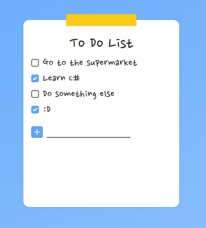

# To Do List

Simple To-do list app developed with Angular, C# and TailwindCSS.


## Running locally

Clone the project

```bash
  git clone https://github.com/KaykySousa/to-do-app-angular-csharp
```

Go to the project directory

```bash
  cd to-do-app-angular-csharp
```

Start the server (C#)

```bash
  cd server
  dotnet build
  dotnet ef database update
  dotnet run
```

Start the front-end (Angular)

```bash
  cd client
  npm install
  npm run start
```

## API Documentation

#### Returns all tasks

```http
  GET /todos
```

#### Returns a task by ID

```http
  GET /todos/${id}
```

| Parameter | Type      | Description           |
| :-------- | :-------- | :-------------------- |
| `id`      | `integer` | **Required**. To-do ID |

#### Create a task

```http
  POST /todos
```

| Parameter | Type     | Description               |
| :-------- | :------- | :------------------------ |
| `title`    | `string` | **Required**. To-do title   |

#### Update a task

```http
  PATCH /todos/${id}
```

| Parameter | Type      | Description                         |
| :-------- | :-------- | :---------------------------------- |
| `id`      | `integer` | **Required**. To-do ID to be updated |
| `title`    | `string` | To-do title   |
| `done`    | `boolean` | If the task is complete |

#### Delete a task

```http
  DELETE /todos/${id}
```

| Parameter | Type      | Description                         |
| :-------- | :-------- | :---------------------------------- |
| `id`      | `integer` | **Required**. To-do ID to be deleted |

## Screenshots

